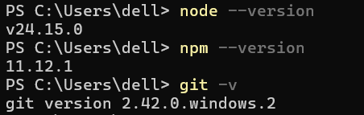

# Claude Code
## 1.环境准备
在 Windows 系统上运行 Claude Code 需要准备以下环境：
1. Node.js (推荐 18.0 或更高版本)
    访问官网 https://nodejs.org/zh-cn 下载，完成后打开 PowerShell，输入 node --version 和 npm --version 验证是否成功
2. Git for Windows
    访问官网 https://git-scm.com/install/windows 下载，完成后同样在PowerShell输入 git --version 进行验证，与步骤一中相同输出版本号，如下：
    

## 2.安装 Claude Code
打开 PowerShell，执行以下命令来安装 Claude Code：
```bash
npm install -g @anthropic-ai/claude-code
```
安装完成后，同样运行 claude --version 验证

这一步也可以配置npm国内镜像：
```bash
npm config set registry https://registry.npmmirror.com/
```
## 3.配置 API (以DeepSeek为例)
1. 获取 DeepSeek API Key
    访问官网 https://platform.deepseek.com/ ，登录后创建一个你自己的 API Key，并把它复制下来（创建后一定要复制，只有一次复制机会，没复制重新创建），然后小氪一点
2. 配置环境变量
用管理员权限打开PowerShell，然后用下面的命令设置(注意修改API Key)：
    ```bash
    setx ANTHROPIC_BASE_URL "https://api.deepseek.com/anthropic"
    setx ANTHROPIC_AUTH_TOKEN "<你的 DeepSeek API Key>"
    setx ANTHROPIC_MODEL "deepseek-v4-pro[1m]"
    setx ANTHROPIC_DEFAULT_OPUS_MODEL "deepseek-v4-pro[1m]"
    setx ANTHROPIC_DEFAULT_SONNET_MODEL "deepseek-v4-pro[1m]"
    setx ANTHROPIC_DEFAULT_HAIKU_MODEL "deepseek-v4-flash"
    setx CLAUDE_CODE_SUBAGENT_MODEL "deepseek-v4-flash"
    setx CLAUDE_CODE_EFFORT_LEVEL "max"
    ```
    修改后重启PowerShell
## 4.启动并使用 Claude Code

启动：在你希望进行代码开发的项目文件夹中打开终端，执行命令 claude

/rewind 回滚
shift+tab 切换模式
! 切换为终端
/effort 切换思考强度
/exit 退出
/resume 查看最近历史
/claude --continue 直接打开上次会话
/init 生成claude.md
/context 查看上下文使用情况
/compact 压缩上下文
/clear 清空上下文